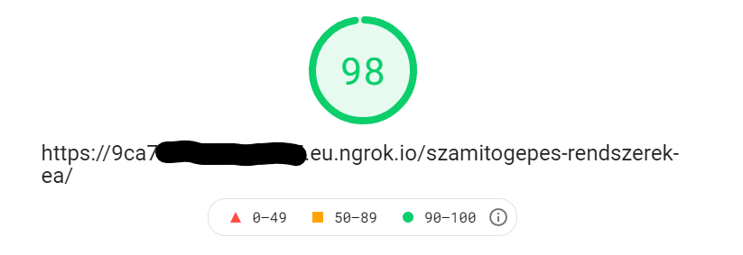
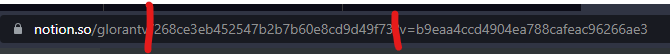

<div id="top"></div>

[![Contributors][contributors-shield]][contributors-url]
[![Forks][forks-shield]][forks-url]
[![Stargazers][stars-shield]][stars-url]
[![GPLv3 License][license-shield]][license-url]

 
# Notion Exporter
A tool written in Java that exports your Notion.so workspace to a static website,

## About The Project
I started this project because I wanted a way to host my notes on my own server instead of Notion's, but every existing solution needed a Node.js backend, so I wansn't able to use my university's server.
This tool generates static HTML from Notion pages, with a CSS included that closely matches the default Notion look. JS code is included for dark mode switching, page sharing, and various other features related
to blocks. 

KaTeX is used for rendering math equations, code blocks are handled by Prism.js, and icons are provided by Feather. Images are automatically optimised for lower storage usage and faster page loads. Depending on page content
of course, you can achieve pretty good PageSpeed scores:



I decided to release this project, as it might be useful for other people in the same situation as I was in.

## Usage

Before running the program, you will need to get an API key from Notion. Here are the steps to get that:
1. Go to https://www.notion.so/my-integrations
2. Click "+ New Integration"
3. Choose a name you find appropriate, and select the workspace you want to use it in
4. Click "Submit"
5. Copy the "Internal Integration Token", you will need this to configure the tool

After the integration has been created, you need to share the pages you with to export with it. To do this:
1. Open a page in your workspace you want to share
2. Click "Share"
3. Click "Invite"
4. Select the integartion you just created

Once all this setup is done, you can move on to configuring this tool. There are two ways to go about this: using the
command-line interface, or creating a configuration file. While you can use the command-line interface, it's recommended to
create a configuration file instead, and this is what I will be writing about here. If you really want to use the CLI, run the program with `--help` to see all available options.

A sample configuration file looks like this:
```toml
[site]
name = "Jegyzetek"
author = "Gerber Lóránt Viktor"
favicon = ""

[notion]
rootPageId = "page-id"
followLinks = true
integrationKey = "api-key"

[export]
folder = "./test-out/"
rewriteIndex = true
fancyNames = true
```

Let's go over each option:
* `name` → The name of your site. Will be displayed in the browser's title bar and added to meta tags
* `author` → The author of the site. Will be display in the page's footer, and added to meta tags
* `favicon` (optional) → The icon that will be displayed in the browser's title bar
* `rootPageId` → The root of your new website. Page discovery starts from here if `followLinks` is enabled, otherwise, the page you want to render
* `followLinks` → Whether to follow links: child pages, page links, page mentions and child databases. You probably want to set this to `true`
* `integrationKey` → The API key you created previously
* `folder` → The folder where your output files will be places in. Must be empty
* `rewriteIndex` → Whether to rewrite page names as `index.html`. For example, if your site is hosted on `https://www.example.com/`, your root page would by default be `https://www.example.com/pageid.html`, but when this is set to `true`, it will be saved as `index.html`. This also works for child pages, those will be saved to a new directory with an `index.html` inside
* `fancyNames` → Controls whether to convert page IDs to human-readable names in URLs. For example, when set to true, the address `https://www.example.com/5999b73f85d04fa9b662be94ecb32a47/268ce3eb452547b2b7b60e8cd9d49f73/` will become `https://www.example.com/notion-exporter-test/zsesemenyek/`

Save this file as `config.toml`, and we can move on to Databases. Databases require extra configuration, because of API limitations (views, sorts and other stuff aren't available in the API). You only need this, if your pages contain more than
just simple tables, because by default, every database is rendered as a table, with all columns showing. If you have a Kanban board for example, you need to configure it here.

Create a file next to your `config.toml` called `database.toml`:
```toml
[547e4c464eb44147b4d2366326211065]
display="board"
columns=["Név", "Nap", "Idő", "Terem", "Csoport"]
sorts=['{"property": "Nap sorszám", "direction": "ascending"}', '{"property": "Napi sorszám", "direction": "ascending"}']
groupBy="Nap"

[d7a88c70129d475dbff6a1ef5ee4334d]
display="table"
columns=["Paradigma", "Jellemzők"]
```

Each database has a section in this file, starting with `[database-id]`. You can get this ID from the Notion URL of your page:



The part between the red is your ID. The options in this file are the following:
* `display` → Sets how your database will be rendered. Valid options as of now are: `table` and `board`
* `columns` → Defines which fields/columns to render, and in which order. By default, everything is rendered
* `sorts` → Defines sorting for this database, like you would in the Notion UI. For more information, click [here](https://developers.notion.com/reference/post-database-query#post-database-query-sort)
* `groupBy` → Only used for Kanban boards, defines which columns to group by
* `filter` → Defines filtering criteria. For more information, click [here](https://developers.notion.com/reference/post-database-query#post-database-query-filter)

If you don't configure a database here, default settings wil be used (table view, everything rendered, no sorting)

Now with all this configuration out of the way, you're ready to export your site. Just run the program with the `--config` argument pointing to your configuration file:
```shell
java -jar notion-exporter.jar --config "./config.toml"
```
After the program completes, your site will be ready to go in the output folder you specified.

### Supported blocks
|Block|Support|Block|Support|
|---:|:---:|---:|:---:|
|Bookmark|✔|Breadcrumb|✔|
|Bulleted List|✔|Callout|✔|
|Child Database|🔨|Child Page|✔|
|Code|✔|Divider|✔|
|Embed|🔨|Equation|✔|
|File|✔|Heading 1|✔|
|Heading 2|✔|Heading 3|✔|
|Image|✔|Numbered List|✔|
|Paragraph|✔|PDF|✔|
|Quote|✔|To-Do|✔|
|Toggle|✔|Video|🔨|
|Database: Table|✔|Database: Kanban|✔|
|Database: Gallery|🔨|Database: Calendar|❌|
|Database: List|🔨|Database: Timeline|❌|
|Table of Contents|🔨|Columns|✔|

* ✔ → fully supported
* 🔨 → work-in-progress
* ❌ → not supported in the near future, or ever

I'm constantly working on new blocks as they become available in the API. Thinks known to not work as of now:
* Database values of type: rollup, relations and formulas
* Child databases inside columns

### Found this project useful?
Consider supporting me on [Ko-Fi](https://ko-fi.com/A8372CD1) or [Coinbase](https://commerce.coinbase.com/checkout/888bc5cd-21a3-4762-b213-1ad39467628b). Any support is appreciated!

## Building

### Prerequisites

To build the project on your machine, you will need:
* Java 8 (or newer)
* [Lombok](https://projectlombok.org/) plugin for your IDE

### Installation

1. Clone the repo
   ```sh
   git clone https://github.com/glorantq/notion-exporter.git
   ```
2. Build the project with Gradle, or import into your favourite IDE

For testing purposes, two scripts are included for hosting your testing output with ngrok.io
* `run-tunnel.sh`
* `run-tunnel-wsl.bat` (this version requires WSL)

These scripts will automatically open an ngrok tunnel to the directory of your choice (`test-out` by default), and open your default browser (requires `wslview` to be installed)

[contributors-shield]: https://img.shields.io/github/contributors/glorantq/notion-exporter.svg?style=flat
[contributors-url]: https://github.com/glorantq/notion-exporter/graphs/contributors
[forks-shield]: https://img.shields.io/github/forks/glorantq/notion-exporter.svg?style=flat
[forks-url]: https://github.com/glorantq/notion-exporter/network/members
[stars-shield]: https://img.shields.io/github/stars/glorantq/notion-exporter.svg?style=flat
[stars-url]: https://github.com/glorantq/notion-exporter/stargazers
[license-shield]: https://img.shields.io/github/license/glorantq/notion-exporter.svg?style=flat
[license-url]: https://github.com/glorantq/notion-exporter/blob/master/LICENSE
